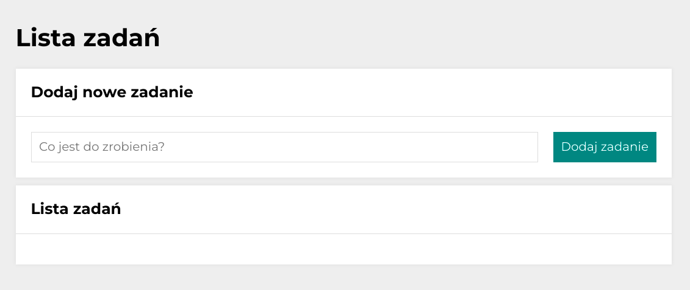

# To-Do List
Link to the project website: https://lukaszwywiol.github.io/tasks/

## Description
### On the Daily Tasks project page, you can add new tasks to your list, mark tasks as completed, and remove them from your task list.

Technologies used in this project:
1. HTML
2. CSS
3. BEM
4. ES6+ features
5. Grid
6. Media queries
7. Immutability array in JavaScript

